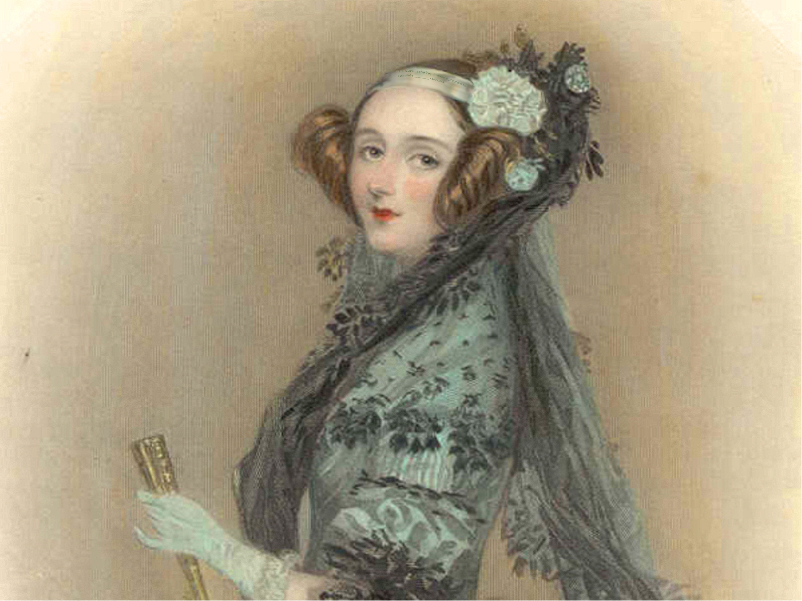
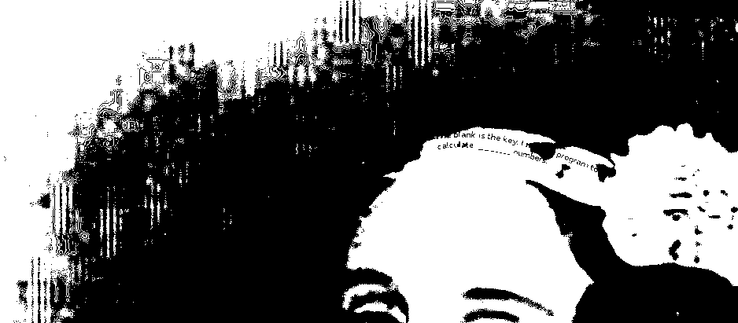

Challenge:



Given an image, when I see a image in ctfs is mostly fall in forensics or steganography so I tried some steganography techniques. Using ```stegsolve``` on the image gave me 



It says ```The blank is the key. I made program to calculate __________ numbers.```
So that is why it is called ```Recon``` so I used google to reverse image search to find whose picture it is. I found out the picture was of ```Ada Lovelace``` who 
```is remembered by many as the world's first computer programmer.```. That makes sense so lets find out what she had program after some googling I found this article
```https://www.livescience.com/63154-ada-lovelace-first-algorithm-auction.html``` and it has the answer we need ```She's written a program to calculate some rather complicated numbers — Bernoulli numbers,``` 

The key we were searching for is ```Bernoulli```
